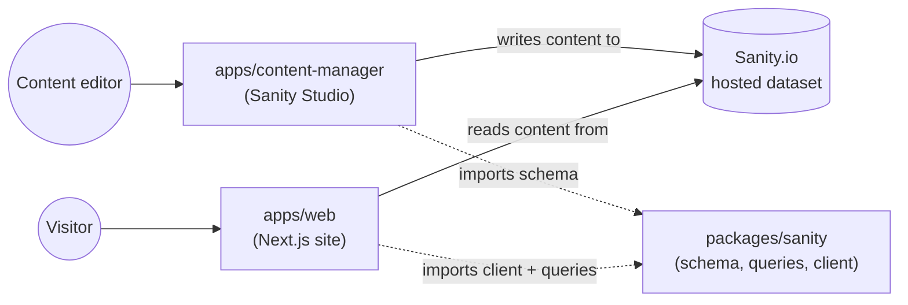

# Personal Portfolio Monorepo

This is the source code for my personal developer portfolio, [hemantsingh.dev](https://hemantsingh.dev). It's a small monorepo with three parts: a Next.js website, a Sanity Studio for managing blog content, and a shared package that connects the two.

I built this from scratch instead of using a template so I could practice patterns I'd actually use on a real production app: typed content fetching, on-demand cache invalidation, a contact form backed by a real database and email provider, and a CMS-driven blog with a live preview workflow.

## What's in here

```
.
├── apps/
│   ├── web/               Next.js site — the actual portfolio (apps/web/README.md)
│   └── content-manager/   Sanity Studio — the blog CMS (apps/content-manager/README.md)
├── packages/
│   └── sanity/            Shared Sanity client, schema, and queries (packages/sanity/README.md)
├── package.json           Root scripts (pnpm workspace)
└── pnpm-workspace.yaml     Workspace definition
```

Each app/package has its own README with the details that are specific to it. This file just covers how the pieces fit together and how to get the whole thing running locally.

## Why a monorepo

The website and the Studio both need to know the shape of a blog post — the same fields, the same GROQ queries, the same TypeScript types. Rather than duplicating that logic (and inevitably letting the two copies drift apart), `packages/sanity` holds the schema and queries once, and both apps import from it.

This is a plain **pnpm workspace** — there's no Turborepo, Nx, or other build orchestrator on top of it. With only two apps and one shared package, plain workspace filtering (`pnpm --filter`) does the job without extra tooling to configure or learn. If this repo grows (more apps, more shared packages, a real need for cached/parallelized builds), Turborepo would be the natural next step.

## How the pieces connect



- **`packages/sanity`** defines what a blog post looks like (the schema) and how to ask for one (the GROQ queries). It exports a configured Sanity client and the generated TypeScript types for query results.
- **`apps/content-manager`** is the editing interface — a Sanity Studio instance that imports the schema from `packages/sanity` and is where blog posts actually get written and published.
- **`apps/web`** is the public site. It imports the client and queries from `packages/sanity` to fetch posts, renders them, and also handles everything that isn't content-driven: the hero/about/projects sections, the contact form, SEO metadata, etc.

Content flows one way: an editor writes a post in the Studio → it's saved to Sanity's hosted dataset → the website fetches it (with caching, see `apps/web`'s README) → a webhook from Sanity tells the website to refresh its cache when something changes.

## Prerequisites

- **Node.js** 20 or later
- **pnpm** (the repo uses pnpm workspaces — npm/yarn won't resolve the `workspace:*` dependency correctly)
- A **Sanity.io** account and project (free tier is enough) — see `packages/sanity/README.md` for how the project ID/dataset are wired up
- A **PostgreSQL** database (for the contact form) — see `apps/web/README.md`

## Getting started

```bash
git clone <this-repo>
cd portfolio
pnpm install
```

Each app needs its own `.env` file (not committed, obviously). Copy the examples and fill them in:

```bash
cp apps/web/.env.example apps/web/.env
cp apps/content-manager/.env.example apps/content-manager/.env
cp packages/sanity/.env.example packages/sanity/.env   # only needed if you run typegen
```

What goes in each file, and where to get the values, is explained in that package's own README — there's a fair number of environment variables (Sanity, a Postgres connection string, Brevo, Upstash Redis for rate limiting) and I didn't want to repeat the same explanation three times.

Then, from the root:

```bash
# run the website
pnpm dev:web

# run the Sanity Studio (in a separate terminal)
pnpm dev:studio
```

The site runs at `http://localhost:3000`, and the Studio at `http://localhost:3333` by default.

## Root scripts

These all live in the root `package.json` and fan out to the individual workspaces:

| Script              | What it does                                                 |
| ------------------- | ------------------------------------------------------------ |
| `pnpm dev:web`      | Starts the Next.js dev server (`apps/web`)                   |
| `pnpm dev:studio`   | Starts the Sanity Studio dev server (`apps/content-manager`) |
| `pnpm build:web`    | Builds the Next.js site for production                       |
| `pnpm build:studio` | Builds the Sanity Studio for deployment                      |
| `pnpm build`        | Builds both, one after the other                             |

**Note:** `pnpm -r lint` and `pnpm -r typecheck` only run the script in workspaces that actually define it. Right now, `lint` only exists in `apps/web`, and `typecheck` only exists in `packages/sanity`. `apps/content-manager` has `eslint` and `typescript` installed but no script entries for either yet — adding `"lint": "eslint ."` and `"typecheck": "tsc --noEmit"` to its `package.json` would make the root commands cover everything.

## License

This is personal portfolio code, shared for reference. Feel free to read it, learn from it, or borrow patterns — please don't republish it as your own portfolio content (the writing, project descriptions, and design are mine).
